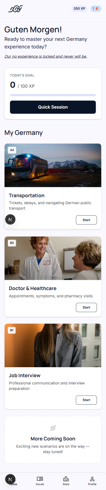
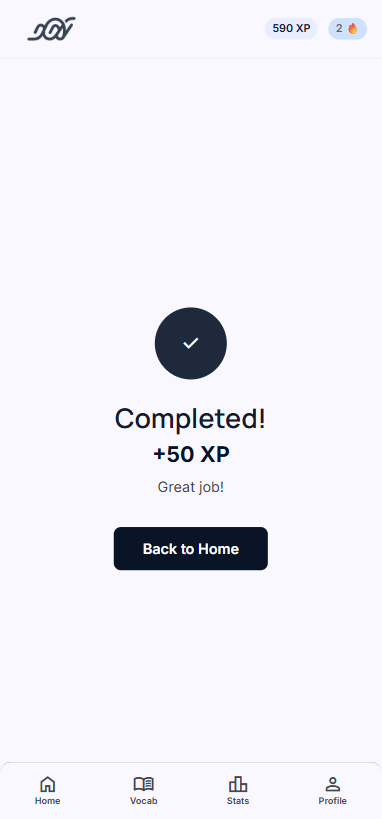
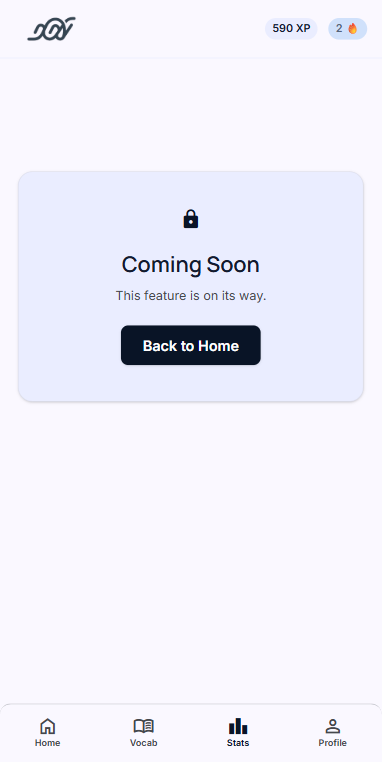

# CanGo — Learn German for Real Life

**CanGo** is a modern, AI-powered Progressive Web App (PWA) that teaches
German through realistic, scenario-based conversations. Built on a
modern AI stack — Next.js 16, TypeScript, Tailwind CSS v4, Drizzle ORM,
NextAuth.js, and Supabase — with offline-first support via IndexedDB and
speech synthesis for authentic pronunciation practice.

- **Prototype:** [Prototype by Google Stitch](https://stitch.withgoogle.com/preview/205405448292237550?node-id=88c0e749cfc44e6ebd7d17ce16426edb)
- **PRD:** [PRD.md](./PRD.md)


## Built With

- **AI Coding Assistant:** Opencode, Antigravity
- **AI Models:** DeepSeek, Gemini
- **Prototyping:** Google Stitch
- **Image Generation:** Nano Banana


## Tech Stack

- Next.js 16, TypeScript, Tailwind CSS v4
- Drizzle ORM + Supabase Postgres
- NextAuth.js v5 (Credentials provider)
- Dexie.js (offline IndexedDB cache)
- Vitest (unit/integration), Playwright (E2E)
- Web Speech API / edge-tts (audio)
- PWA (manifest, service worker)


## Features

- Real-world scenarios: transportation, doctor visits, job interviews
- Adaptive CEFR levels (A2 → B1 → B2)
- Interactive challenges: MCQs, matching, dialogue ordering, best-response
- PWA: installable with offline support via service worker
- Speech synthesis for German pronunciation practice
- Streak tracking and XP rewards
- Supabase + NextAuth credentials authentication

---

## Setup

### 1. Environment Variables

```bash
cp .env.local .env
```

Fill in your Supabase credentials in `.env`:

- `DATABASE_URL` — Postgres connection string (Supabase)
- `AUTH_SECRET` — Generate with `npx auth secret`
- `AUTH_URL` — `http://localhost:3000`

### 2. Install Dependencies

```bash
npm install
```

### 3. Push Database Schema

```bash
npm run db:push
```

### 4. Seed Content Data

```bash
npm run seed
```

> The seed script is idempotent — it can be run multiple times without errors.
> Existing experiences are updated in place, preserving user progress data.

### 5. Generate Audio (Optional)

```bash
bash scripts/generate-audio.sh
```

### 6. Run Dev Server

```bash
npm run dev
```

Open [http://localhost:3000](http://localhost:3000).

## Testing

```bash
# Unit & integration tests
npm test

# E2E tests (requires a test user — sign up at /auth first)
npm run test:e2e

# E2E tests with visible browser (headed mode)
npm run test:e2e -- --headed

# E2E interactive UI debugger
npm run test:e2e -- --ui
```

> E2E tests use Playwright with Chromium. Update credentials in `e2e/auth.setup.ts` to match your test account.

## Auth

- Sign up / Log in with email + password via `/auth`
- Credentials are stored in Supabase `users` table with bcrypt-hashed passwords
- Protected routes redirect to `/auth` if unauthenticated

## Screenshots

| | |
|---|---|
|  |  |
|  |  |
|  | |
